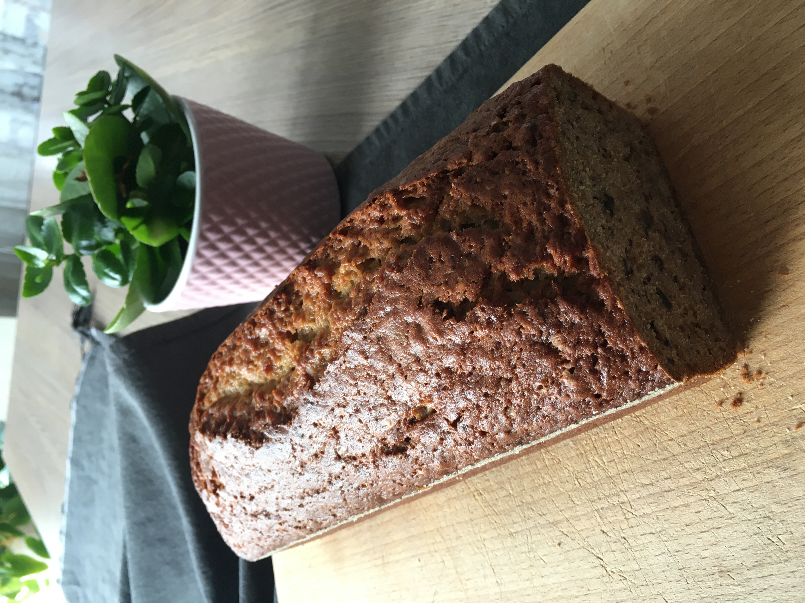

# Banánový chlebíček

_Zdroj: babiš_

## Ingredience

- 8 lžic másla
- 1 hrnek cukru krystal
- 2 vejce
- 1/4 hrnku mléka
- 1 vanilkový cukr
- 4 menší přezrálé banány, rozmačkané vidličkou
- 2 hrnky hladké mouky
- 1 lžička sody
- 1/4 lžičky soli
- vrchovatá hrst ořechů, nasekaných

## Postup

Zapněte troubu na 180 stupňů. Formu na chlebíček vymažte  a vysypte hrubou moukou.

Máslo rozpusťte a nechte zchladnout. Vejce rozšlehejte. Banány rozmačkejte.

Smíchejte sypké ingredience, potom přidejte vše zbývající a vymíchejte do hladkého těsta. Nalijte do formy a pečte cca 50 minut. Povrch musí být zlatohnědý.

Nechte 10 minut zchladnout, potom vyklopte z formy a nechte úplně vychladnout.
