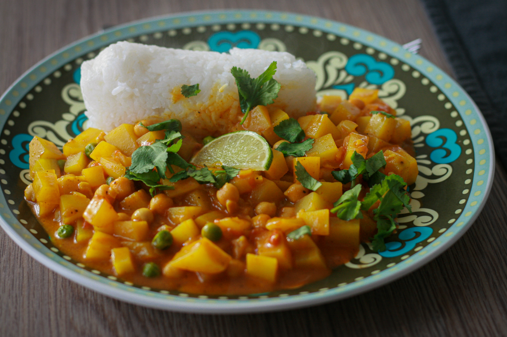
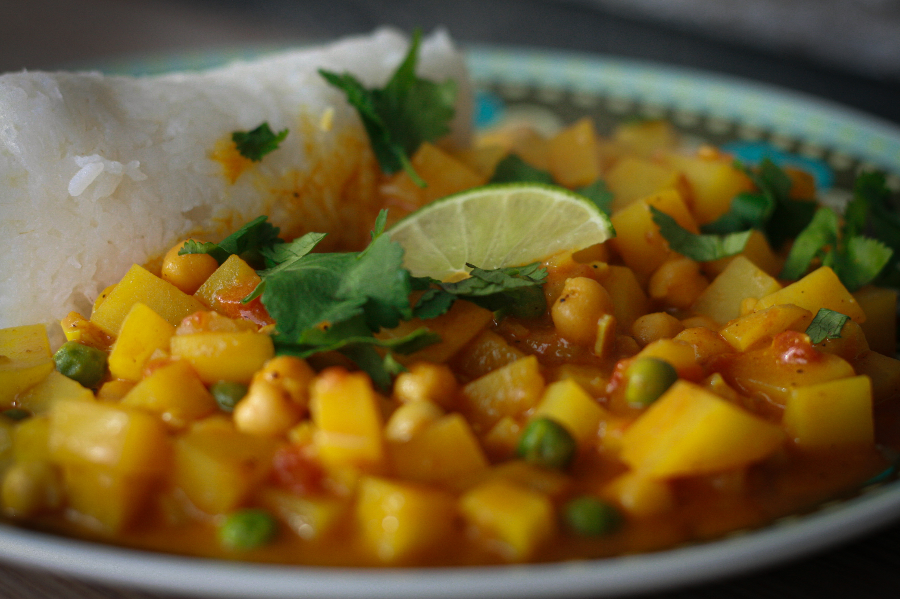
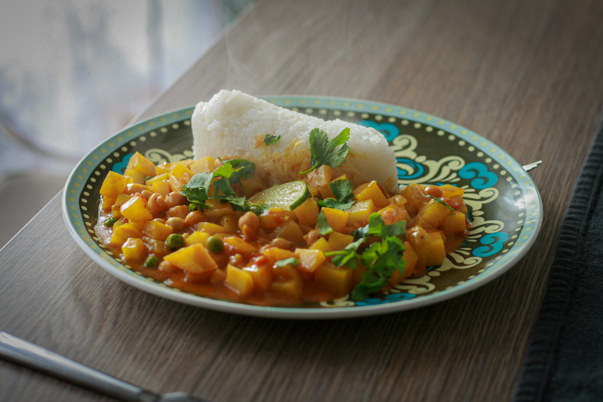

# Bramborové kari

_Zdroj: Apetit, říjen 2022, strana 97_

## Ingredience

- 2 lžíce rostlinného oleje
- 1 cibule, nakrájená nadrobno
- 3 stroužky česneku, nakrájené nadrobno
- 1 lžíce zázvoru, nakrájeného nadrobno
- 1 lžíce kari koření
- 2 lžičky koření garam masala
- 2 lžičky mletého římského kmínu
- 1 lžička mleté kurkumy
- sůl
- špetka kajenského pepře
- 1kg brambor, varný typ A, oloupaných a nakrájených na kostičky
- 1x 400g konzerva vařené cizrny
- 1x 400g konzerva drcených rajčat
- 1x 400g konzerva kokosového mléka
- krupicový nebo třtinový cukr dle chuti
- limetová šťáva dle chuti
- hrst mraženého hrášku
- čerstvý koriandr k podávání
- vařená rýže k podávání

## Postup

V pánvi rozehřejte olej, vsypte cibuli a nechte ji na mírném plameni zvolna zesklovatět. Přidejte česnek, zázvor a nechte rozvonět. Vsypte kari, garam masalu, římský kmín, kurkumu, sůl a kajenský pepř. Minutu opékejte, aby se koření rozvonělo. Vmíchejte brambory. Přidejte cizrnu, rajčata, kokosové mléko a vařte do změknutí brambor. Díky rajčatům budou na povrchu pevné, uvnitř měkké.

Dochuťte cukrem, limetovou šťávou, vmíchejte hrášek a nechte prohřát. Podávejte s čerstvým koriandrem a rýží.
