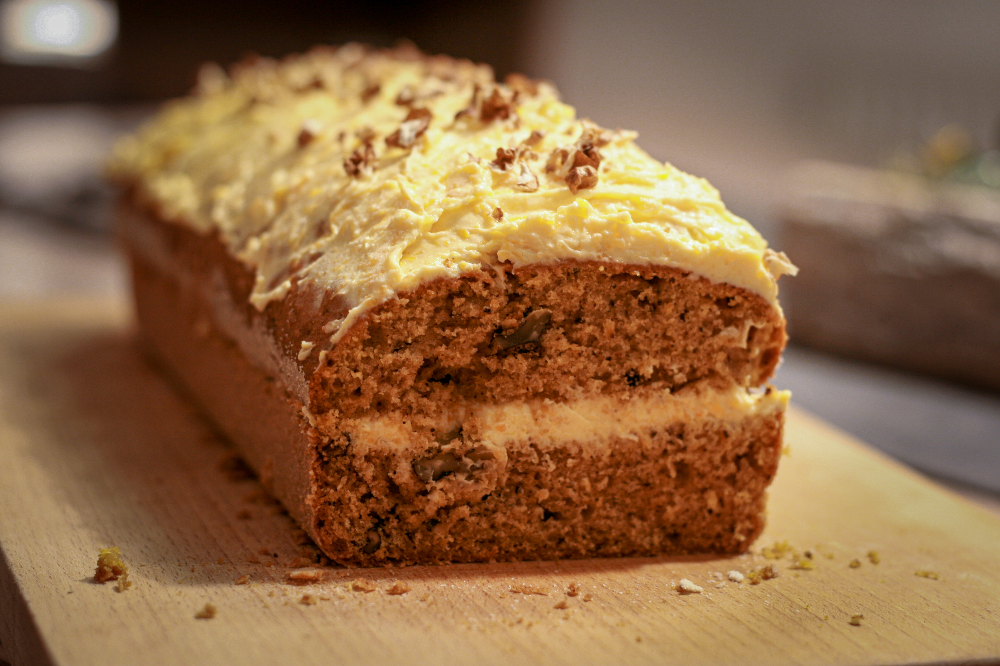
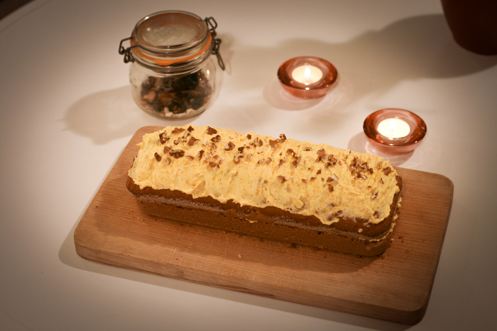
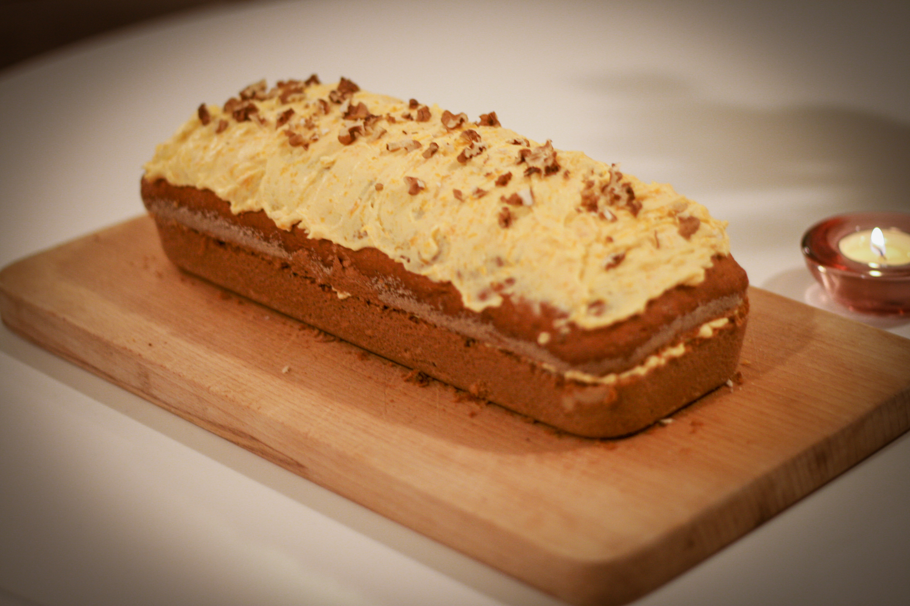

# Dýňový chlebíček

_Recept je upravený podle mnoha jiných. Výchozí je v Joga dnes, září-říjen 2022._

## Ingredience

- 200g hladké mouky
- 200g dýňového pyré
- 130g změklého másla
- 130g třtinového cukru
- 100g nasekaných ořechů
- 3 vejce
- 1 vrchovatá čajová lžička jedlé sody
- špetka vanilky
- citronová kůra z bio citronu
- (1 lžíce perníkového koření)

## Postup

Nemáme-li hotové dýňové pyré, nakrájíme oloupanou dýni na menší kousky a buď je povaříme v menším množství vody, nebo upečeme v troubě. Změklou dýni rozmixujeme na pyré konzistence řidší bramborové kaše.

Vajíčka ušleháme s cukrem do světlé pěny a postupně zašleháme i změklé máslo.

Po chvíli vmícháme i dýňové pyré a poté i ostatní suroviny.
Troubu předehřejeme na 170 stupňů. Formu na biskupský chlebíček vymažeme máslem, vysypeme hrubou moukou a naplníme ji hotovým těstem. 

Vložíme do vyhřáté trouby a pečeme zhruba 45 minu, i více.

Hotový chlebíček po vychladnutí vyjmeme z formy a můžeme ho zdobit dýňovým krémem.

## Dýňový krém - suroviny

* 200g lučiny
* 100g dýňového pyré
* cukr moučka podle chuti
* citronová šťáva

## Postup

Lučinu, dýňové pyré, cukr a citronovou šťávu vyšleháme do hladkého krému. Krém naneseme na hotový vychladlý chlebíček.
