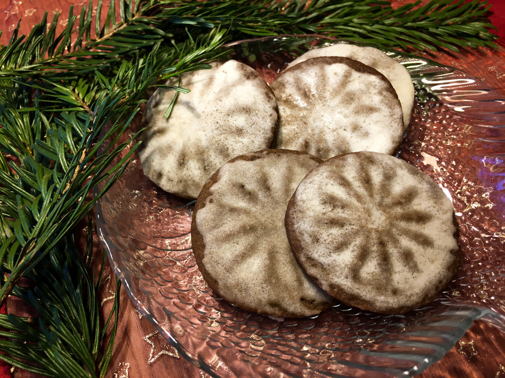

# Glazované peprníčky

_Zdroj: Apetit, prosinec 2022, strana 60_

## Ingredience

- 90g másla, pokojové teploty
- 90g třtinového cukru
- 100g melasy z třtinového cukru
- 1 žloutek
- 235g hladké mouky + na podsypání
- 1/2 lžičky jedlé sody
- 1 lžička mletého zázvoru
- 1/2 lžičky mleté skořice
- 1/2 lžičky perníkového koření
- 1/4 lžičky čerstvě umletého pepře

### Na polevu

- 80g moučkového cukru
- špetka mleté skořice
- 15g rozpuštěného teplého másla
- 1 lžíce rumu
- teplá voda na rozředění (cca 1 lžička)

## Postup

Utřete v míse společně máslo, cukr a melasu do pěny. Přidejte žloutek, promíchejte.

Všechny suché přísady prosejte do mísy a zapracujte do těsta - můžete použít míchací metlu v robotu puštěném na nízké otáčky. 

Pokud je těsto suché a nechce se spojit, přidejte 1 lžíci ledové vody. Vyklopte těsto na pracovní desku a zploštěte jej do disku, zabalte a uložte na 30 minut do chladničky.

Předehřejte troubu na 180 stupňů. Dva plechy vyložte pečícím papírem. Pracovní desku lehce posypte moukou a těsto rozválejte na tloušťku 5mm. Razítko na sušenky nebo dno broušené skleničky obtiskněte do mouky, setřeste přebytečnou mouku a pevně vtlačte do těsta. Vykrájejte tvary pomocí vykrajovátka na sušenky, které je o něco větší než otisk. Pokračujte do spotřebování těsta.

Přeneste na plech ve zhruba 2cm rozestupech a pečte 8-9 minut. Během pečení jednou otočte plechy v troubě. Upečené sušenky budou měkké, ale postupně zpevní - pozor na přepečení.

Na polevu prosejte moučkový cukr a skořici do mističky. Přidejte rozpuštěné máslo, rum, vodu a vyšlehejte dohladka. Perníčky natírejte buď ještě teplé, nebo vychladlé - výsledek je trochu jiný.
