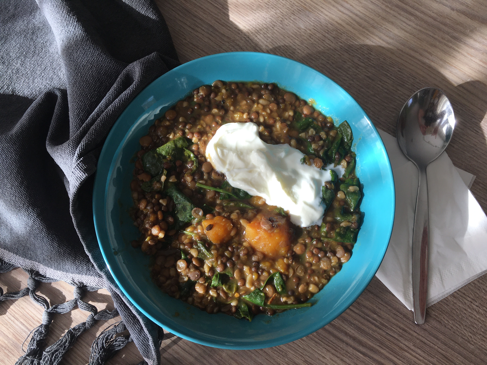
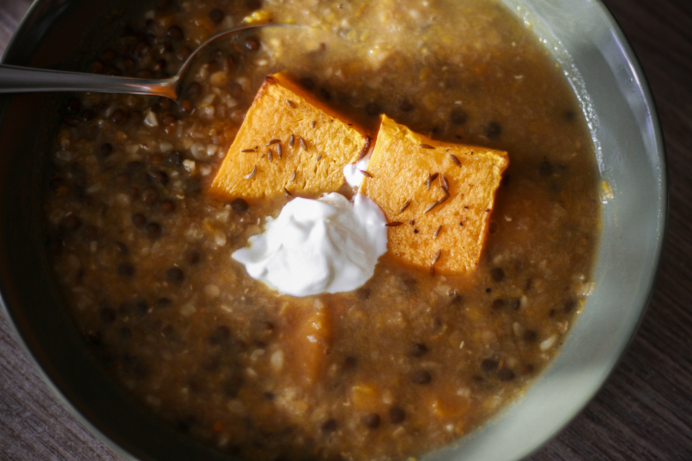
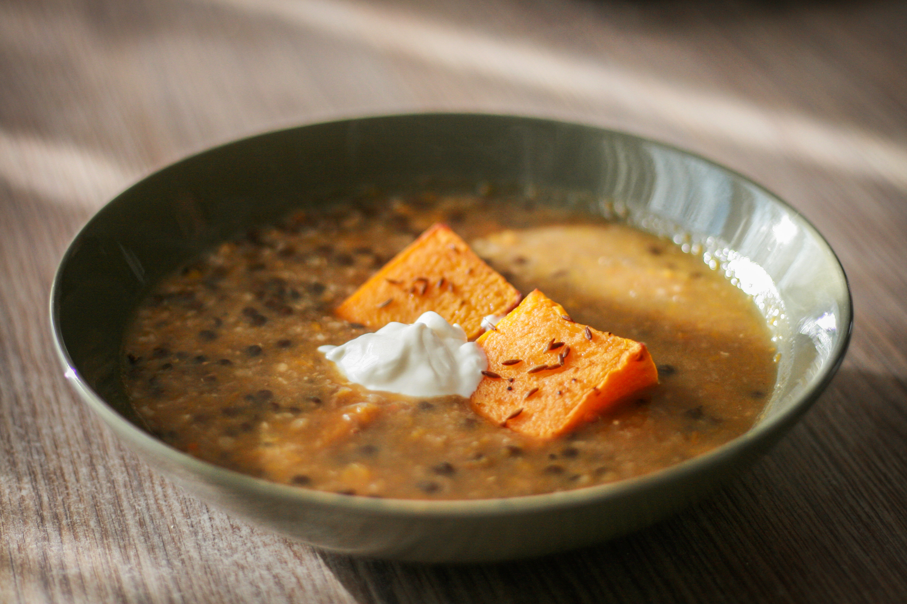
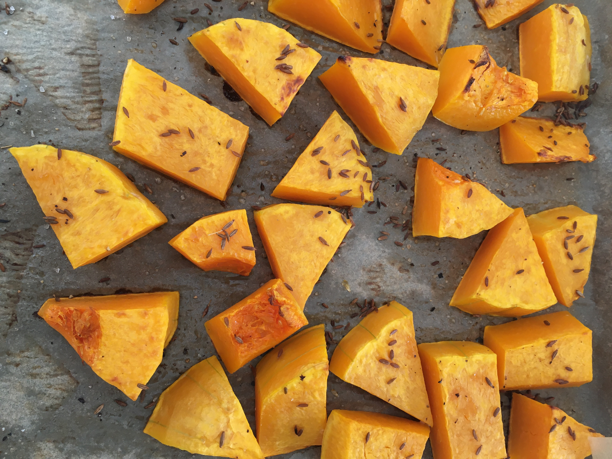

# Kořeněná dýňovo-čočková polévka se špenátem

_Zdroj: Apetit, únor 2022, strana 65_

Pro 6 osob.

## Ingredience

- 400g máslové dýně, oloupané a nakrájené na kostky
- 2 lžíce olivového oleje
- sůl a čerstvě mletý pepř
- 2 lžičky + pár špetek římského kmínu, opražených
- 300g drobné zelené čočky (například puy), propláchnuté
- cca 2 litry horkého zeleninového vývaru
- 80g bulguru
- 200g baby špenátu
- 1/2 citronu, kůra nastrouhaná najemno a vymačkaná šťáva
- 6 lžic bílého jogurtu

## Postup

Troubu předehřejte na 220 stupňů, horkovzdušnou na 200. Dýni dejte na plech, pokapejte olivovým olejem, osolte, opepřete, posypte 2 lžičkami římského kmínu. Pečte dozlatova 25-30 minut.

Polovinu dýně přesuňte z plechu do hrnce. Vsypte čočku a zalije 1,5 litru vývaru, přiveďte k varu, pak zmírněte oheň a zvolna vařte 35-40 minut. Na posledních 10 minut přidejte bulgur.

Vařečkou rozdrťte v polévce část dýně. Vmíchejte špenát, citronovou kůru i šťávu, další vývar podle potřeby i zbývající dýni. Prohřejte. Podávejte s kopečkem jogurtu, posypané zbývajícím opraženým římským kmínem.

Na polévku používáme čočku takovou, jakou máme zrovna ve spíži, popř. kombinujeme více druhů. Špenát je v polévce vynikající, ale když není, nevadí to.
