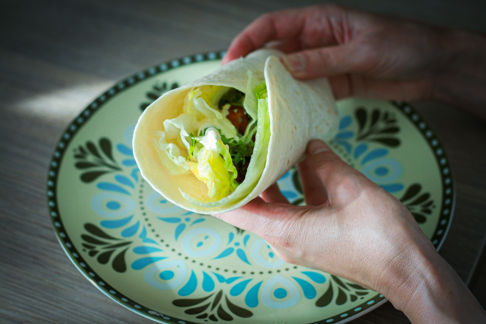
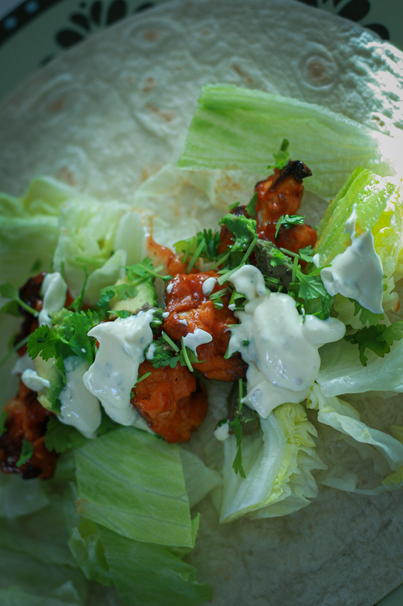
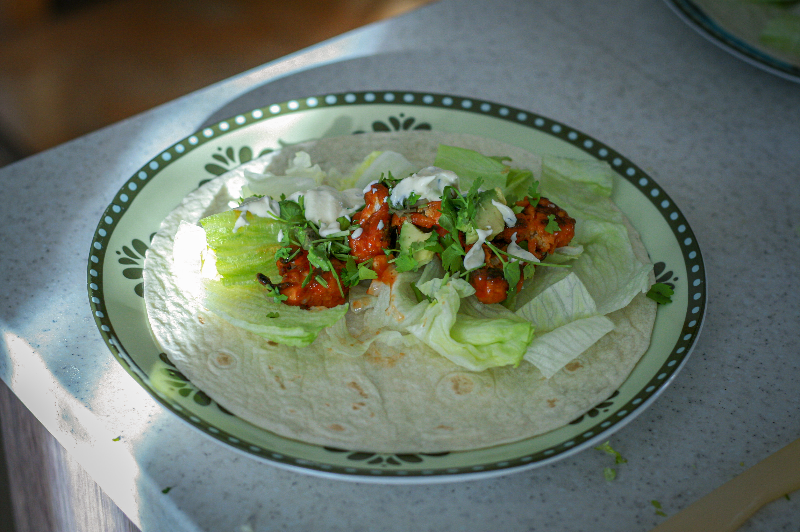

# Květákové buffalo tacos

_Zdroj: Apetit, srpen 2021, strana 21_

## Ingredience

* 1 květák
* rostlinný olej na vymazání
* 1/2 hrnku hladké mouky
* 1/2 hrnku podmáslí
* 1 lžička mleté papriky
* 1-2 lžičky česnekového prášku
* 1-2 lžičky cibulového prášku
* 1 hrnek buffalo omáčky
* sůl a čerstvě mletý pepř dle chuti
* 8 malých pšeničných nebo kukuřičných tortill
* 1 římský salát, pokrájený
* 1-2 avokáda, zbavená pecky, nakrájená na plátky
* koriandr k podávání

### Na dresink

* 1/2 hrnku majonézy
* 1/2 hrnku zakysané smetany
* 1 lžíce pažitky, nakrájené nadrobno
* 1/2 lžičky česnekového prášku
* 1/2 lžičky cibulového prášku
* 1 lžička sušených italských bylinek

## Postup

Troubu předehřejte na 220 stupňů. Plech vymažte olejem. (My Pečeme na pečícím papíře.)

Květák zbavte listů, rozdělte na růžičky a ty překrájejte na velikost sousta. Do mísy dejte hladkou mouku, podmáslí, koření a asi 1/4 hrnku buffalo omáčky. Promíchejte, přidejte květák a znovu promíchejte. Rozprostřete na plech a dejte péct na 20-30 minut. V polovině promíchejte.

Všechny ingredience na dresink prošlehejte.

Tacos placky ohřejte nebo lehce opečte nasucho na pánvi. 

Zbylou buffalo omáčku ohřejte. Květák vyjměte z trouby, 
vsypte do misky, přelijte buffalo omáčkou a promíchejte.

Doprostřed tacos dejte salát, na něj plátky avokáda, květák a zakápněte dresinkem. Ozdobte koriandrem a podávejte.
