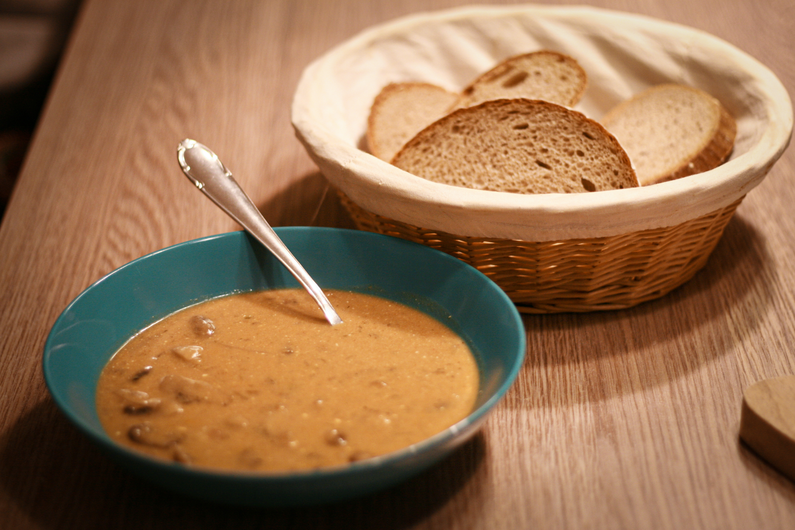
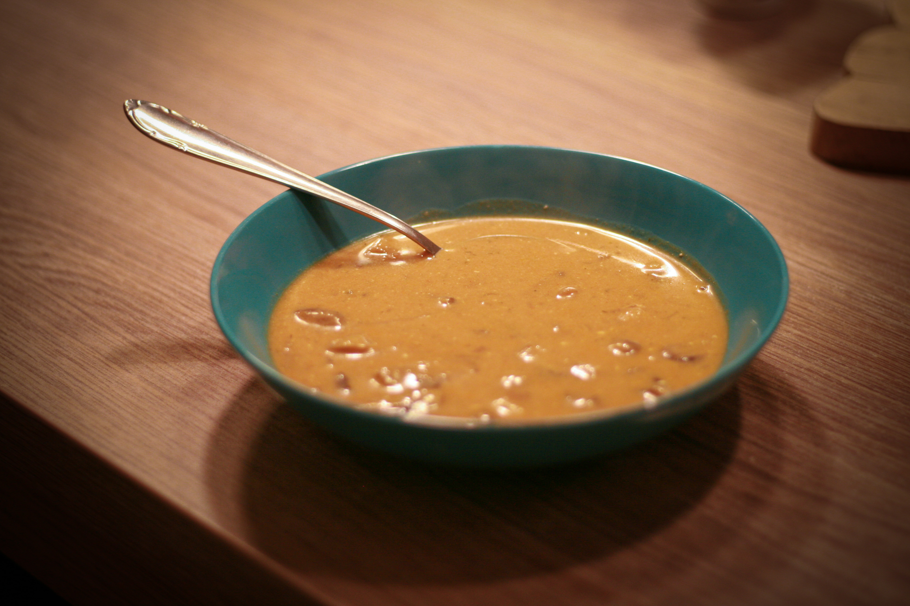

# Maďarská žampiónová polévka

_Zdroj: Apetit, únor 2020, strana 16_

## Ingredience

- 2 lžíce másla
- 1 velká bílá cibule, nakrájená nadrobno
- 500g žampionů, nejlépe hnědých, nakrájených na čtvrtky
- 3 lžíce hladké mouky
- 2 a 1/2 lžičky dobré mleté sladké papriky
- 100 ml bílého vína
- 300 ml zeleninového vývaru
- 200 ml mléka
- 2-3 lžíce sójové omáčky
- 3 lžíce zakysané smetany + další k podávání
- 3 lžíce kopru, nasekaného nadrobno (může být i sušený)
- šťáva z 1/2 citronu
- Sůl a čerstvě mletý pepř
- hrst hladkolisté petržele, nakrájené nadrobno

## Postup

V hrnci na másle opékejte cibuli dosklovita. Vmíchejte žampiony a opečte je. Když začnou měknout, zaprašte je moukou a paprikou a krátce zarestujte. Pak přilejte víno a nechte je částečně odvařit. Přilijte vývar, mléko, sójovou omáčku. Přiveďte k varu a vařte na mírném ohni asi 10-15 minut. Sundejte z plotny.

Vmíchejte zakysanou smetanu a kopr a podle chuti okyselte citronovou šťávou. Dochuťte solí a pepřem.

Podávejte posypané petrželkou a se štědrou lžící zakysané smetany.
