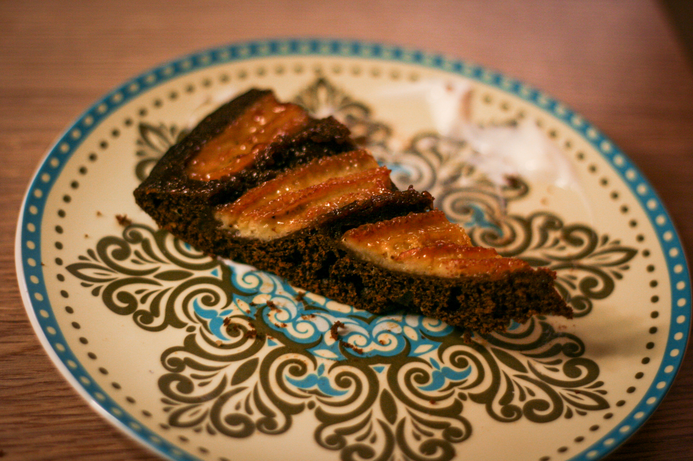
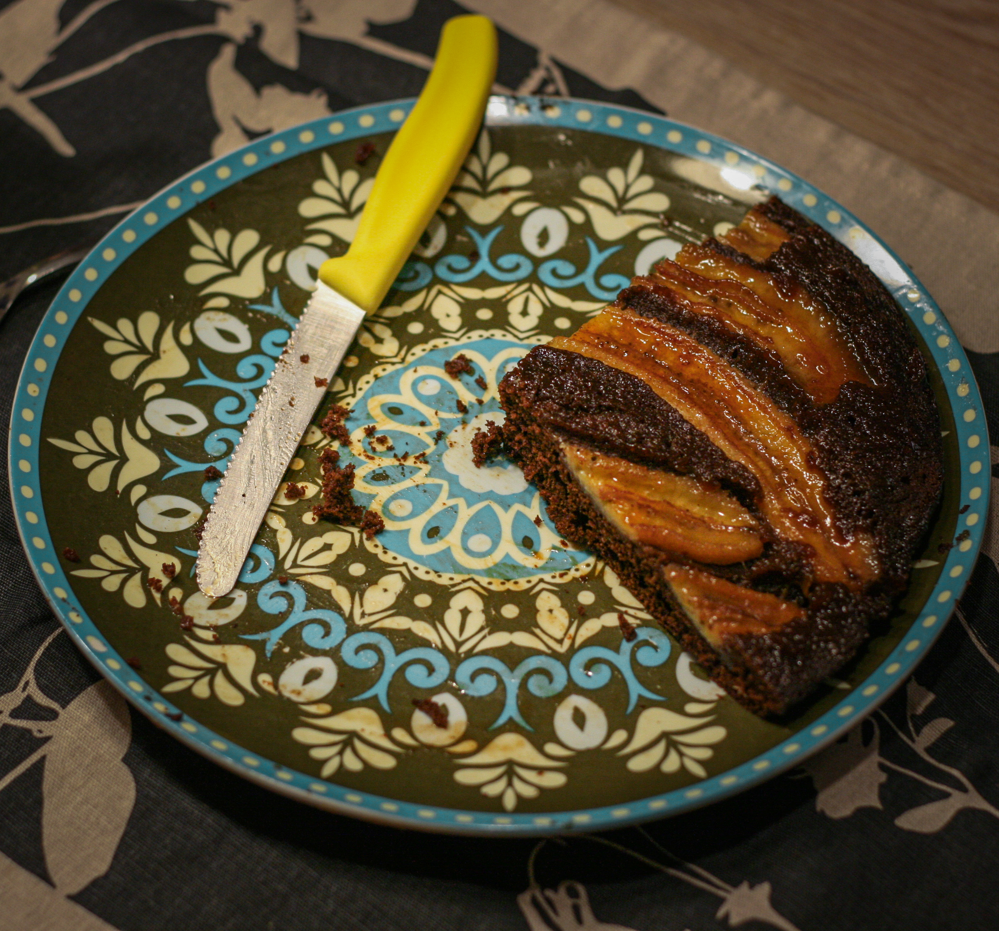

# Obrácený banánový koláč z pánve

_Zdroj: Apetit leden 2024, str. 12._

Příprava 10 minut, opékání 25 minut, 1 koláč o průměru 25 cm

## Ingredience

- 20g másla
- 15g krupicového cukru
- 3 velké banány

Na těsto

- 1 vejce
- Špetka soli
- 50g krupicového cukru
- 8g vanilkového cukru
- 50ml rostlinného oleje
- 100ml mléka
- 120g hladké mouky
- 20g kakaa holandského typu
- 1/2 lžičky mleté skořice
- 8g kypřícího prášku do pečiva
- lžička octa

K podávání

- ušlehaná smetana, creme fraiche nebo zakysaná smetana
- karamelová poleva

## Postup

V nepřilnavé pánvi s vyšším okrajem o průměru 25 cm na středním ohni rozpusťte máslo. Vsypte cukr a za občasného míchání silikonovou stěrkou nechte zkaramelizovat.
Banány oloupejte a podélně rozpulte. Na karamel rozložte banány vezmou stranou dolů.Ihned vypněte oheň a nechte zchladnout.
Připravte těsto. V míse prošlehejte metličkou vejce se špetkou soli, cukrem a vanilkovým cukrem. Přilijte olej a dobře zašlehejte. Poté zašlehejte mléko. Přes síto vsypte mouku, kakao, skořici a prdopeč a zašlehejte metličkou. Nakonec přidejte ocet a rychle zašlehejte.
Hotovým těstem  zalijte vychladlé banány na pánvi a pomocí stěrky těsto rovnoměrně rozprostřete. Zapněte oheň na nízký stupeň (nejmíň možný, úplně stáhnout plamen na našem sporáku, jinak bude koláč černý!!!!), zakryjte pokličkou a zvolna opékejte 15-20 minut. Propečení otestujte špejlí. Pomocí velkého talíře otočte a opékejte ještě 5 minut z druhé strany. Před podáváním koláč **nechat vychladnout**, potom teprve vyklopit z pánve, jinak se trhá.
Podávejte se šlehačkou, creme frakce nebo zakysanou smetanou a karamelovou polevou. (Nedáváme ani smetanu, ani polevu. Jíme jen tak.)

