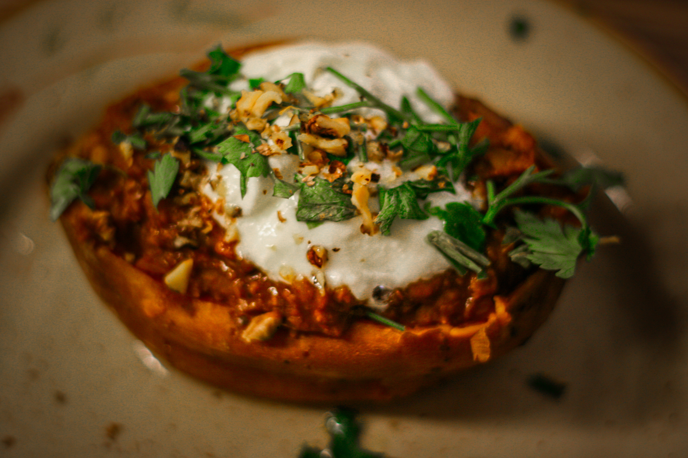
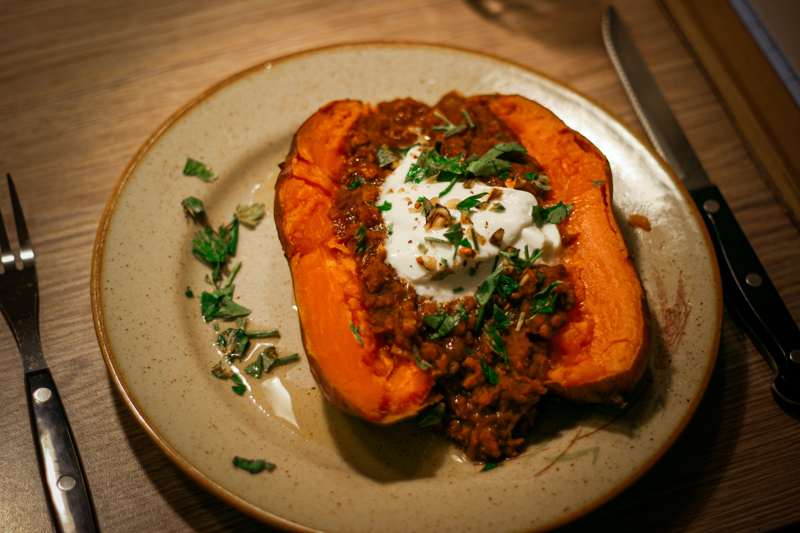

# Pečené batáty plněné červenou čočkou

_Apetit, leden 2024, strana 52._

Příprava a vaření 35 minut. Pečení 70 minut

Pro 4 osoby.

## Ingredience

- 4 velké batáty
- 3 lžíce olivového leje
- 1 cibule, nakrájená najemno
- 3 stroužky česneku, drcené
- 3 lžíce rajčatového protlaku
- 190 g červené čočky
- 1 lžička mleté uzené papriky
- 1/2 lžičky mletého koriandru
- 1/2 lžičky mletého římského kmínu
- 1/2 lžičky drcených chilli vloček + na posypání
- Cca 700 ml zeleninového vývaru
- Sůl a čerstvě mletý pepř
- 1-2 lžičky červeného vinného octa nebo podle chuti
- 50 g sekaných vlašských ořechů
- Bílý jogurt na ozdobení
- Čerstvá hladkolistá petrželka

## Postup

Předehřejte troubu na 200 stupňů. Do každého batátu několikrát píchněte vidličkou, potřete ho olejem a zabalte do alobalu. Položte na středovou mřížku trouby a pečte 60-70 minut. Pak vyjměte z trouby a nechte v alobalu dojít.

Mezitím rozehřejte zbylý olej na pánvi a osmahněte na něm cibuli dosklovita, přidejte česnek a rajčatový protlak. Restujte a míchejte, až protlak začne měnit barvu a česnek zavoní. Vmíchejte čočku a koření. Promíchejte a nechte společně chvilku rozvonět na pánvi. Přilijte vývar, osolte, opepřete. Přiveďte směs rychle k varu, pak teplotu stáhněte, přikryjte a zvolna vařte 20-25 minut, dokud čočka nezměkne a tekutina se nevstřebá. Pokud je to potřeba, dolijte vodu. Dochuťte podle potřeby solí, pepřem, vmíchejte ocet a nasekané vlašské ořechy.

Upečené batáty vyjměte z alobalu a podélně uprostřed nařízněte. Rovnoměrně naplňte čočkovou směsí. Navrch dejte velkou lžíci jogurtu, zdobte nasekanou petrželkou a chilli vločkami.

