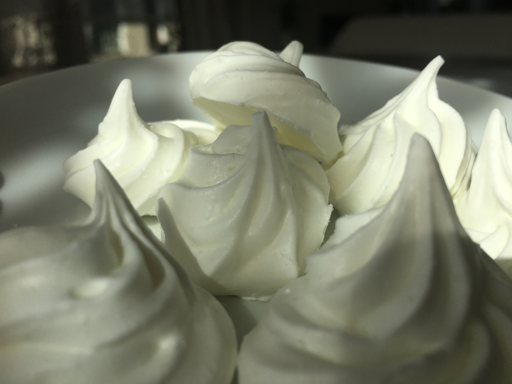
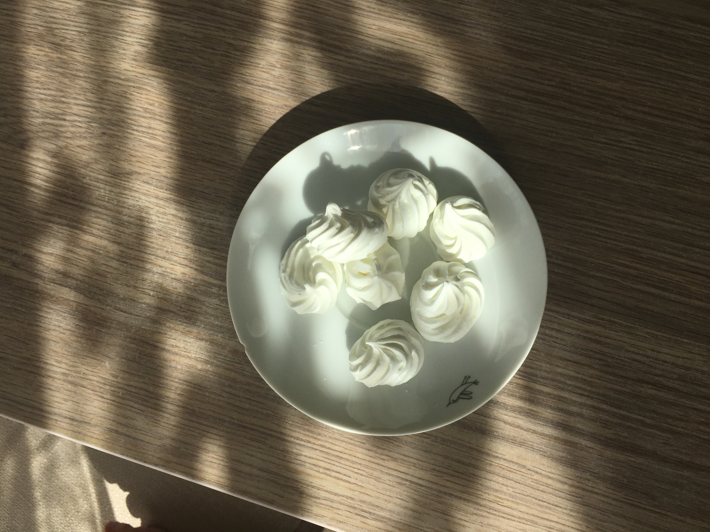
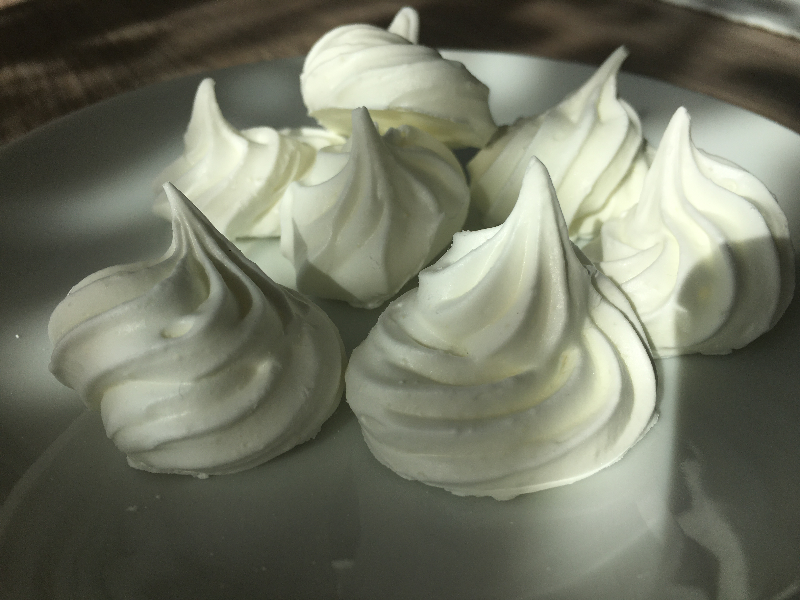

# Pusinky

**Cenný recept na jednoduchou, avšak velmi efektní přípravu pusinek. V tomto receptu je již uvedena poloviční dávka, aby se do trouby najednou daly dát všechny, tedy ne více než tři, plechy.**

_Zdroj: Od babiš._

## Postup

Do mísy dáme 16 dkg **vaječných bílků** + 6 dkg **krupicového cukru**.

Šleháme na plné otáčky, až vzniknou jemné špičky.

Pak otáčky trochu zmírním a posypeme s 10 dkg **krupicového cukru**.

Opět zvýšit, dokud to nebudou plné špičky.

Přidáme **16 dkg moučkového cukru**, a to se už nemusí dát na vysokou rychlost, stačí nižší, a nechat dostatečně dlouho, až se to spojí tak, že zůstává sníh ve šlehací metle.

Plech s pečícím papírem, chytneme zespodu v rozích, a tvoříme.

Do vyhřáté trouby na 85 - 90 stupňů, horkovzduch, cca na půl druhou hodinu, nebo i déle. Pusinka bude zvonit, když se do ni drncne.

