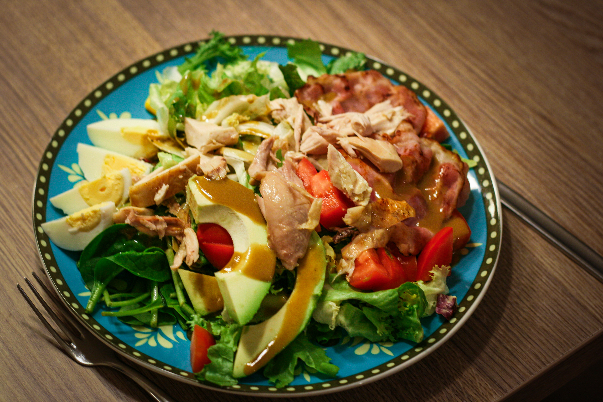
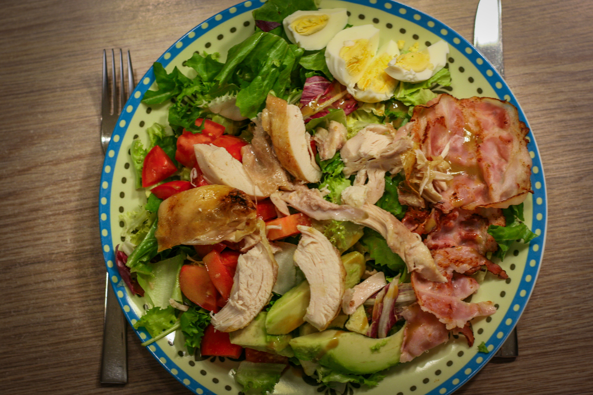

# Teplý kuřecí salát

**Když má náš tatínek možnost rozmáchnout se v kuchyni bez dozoru a dotěrných otázek typu "Co hledáš?“, „Potřebuješ něco?“, připraví skvostný teplý kuřecí salát a do vychládající trouby po kuřeti vloží [božské pusinky](./pusinky.md) podle naší babiš k odpolední kávě.**

_Zdroj: S Penny u stolu, zima 2023, str. 46._

4 porce, příprava 30 minut, vaření 6 minut (+ pečení kuřete)

## Ingredience

- 6 vajec
- 100g plátků slaniny
- 2 lžíce bílého balzamikového octa nebo 1 lžíce obyčejného octa a trocha medu
- 1 lžíce dijonské hořčice
- 1 lžíce vody
- 4 lžíce extra panenského olivového leje
- Sůl a čerstvě mletý barevný pepř
- 1 vanička směsi salátů
- obrané maso z 1/2 pečeného kuřete, teplé
- 2-4 rajčata, nakrájená na klínky
- 1 avokádo, vypeckované, oloupané, nakrájené na klínky

## Postup

Uvařte vajíčka natvrdo, nechte zchladnout, oloupejte a dejte stranou.

Slaninu opečte na pánvi dokřupava. Nechte okapat na papírových utěrkách. Horký tuk z pánve či plechu prošlehnete metlou s octem, hořčicí a 1 lžící vody do hladké směsi. Za stálého šlehání přilévejte postupně olej, aby vznikl hustý dresink, osolte a opepřete.

Na servírovací mísu naaranžujte salátové listy, pokapejte polovinou teplého dresinku. Vejce rozpulte a naskládejte je na salát spolu s teplým kuřecím masem, rajčaty, avokádem a slaninou. Opepřete.
Podávejte se zbývajícím dresinkem na pokápání.

