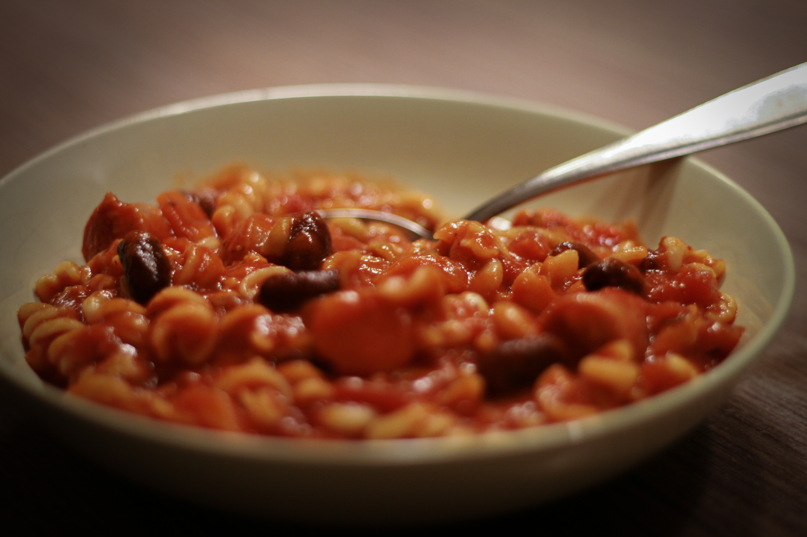
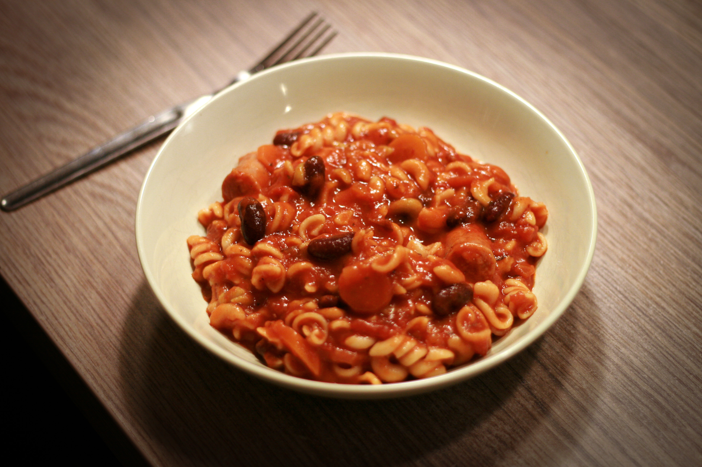

# Vinná klobása v rajčatové omáčce s těstovinami

_Zdroj: Apetit, leden 2022, strana 23._

Pro 4-6 osob.

## Ingredience

- 2 lžíce rostlinného oleje
- 500g vinné klobásy
- 1 velká cibule, nakrájená nadrobno
- 500 ml hovězího vývaru
- 400g konzerva krájených rajčat
- 500 ml rajčatové passaty
- 4 řapíky celeru, nakrájené na kostičky
- 2 mrkve, nakrájené na kolečka
- 400g konzerva bílých fazolí, scezená, propláchnutá a okapaná
- 2 lžičky nasekaného čerstvého oregana nebo 3/4 lžičky sušeného
- 2 lžičky lístků čerstvého tymiánu nebo 3/4 lžičky sušeného
- 1 lžička česnekového prášku
- 1 lžička chilli omáčky (nebo víc, podle chuti)
- sůl a čerstvě mletý pepř
- 200-300g středně velkých suchých těstovin ("vrtule")
- hrst nasekané čerstvé petrželky + k podávání
- hrst třešňových rajčátek, rozkrojená na půl

## Příprava

Ve velkém hrnci opečte na oleji vinnou klobásu dozlatova a tak, aby byla propečená. Pak ji vyjměte na talíř a z hrnce odeberte přebytečný tuk, na zbývajícím opečte cibuli dosklovita.

Vlijte vývar, rajčata, passatu, vsypte řapíkatý celer, mrkev, fazole, oregano, tymián, česnekový prášek, přidejte chilli omáčku, podle chuti opepřete. Přiveďte k varu. Zmírněte oheň; přiklopte a vařte cca 15 minut. Mezitím nakrájejte vinnou klobásu na 2-3 cm kousky.

Vsypte těstoviny a petrželku a přiklopené vařte, aby těstoviny změkly, trvá to 10-14 minut. Pět minut před koncem vaření vsypte nakrájenou vinnou klobásu a prohřejte ji. Pokud by směs příliš zhoustla, aniž by těstoviny změkly, vmíchejte horkou vodu. Podávejte posypané další petrželkou a rajčátky. Můžete dozdobit i čerstvým tymiánem a oreganem, máte-li je po ruce.
