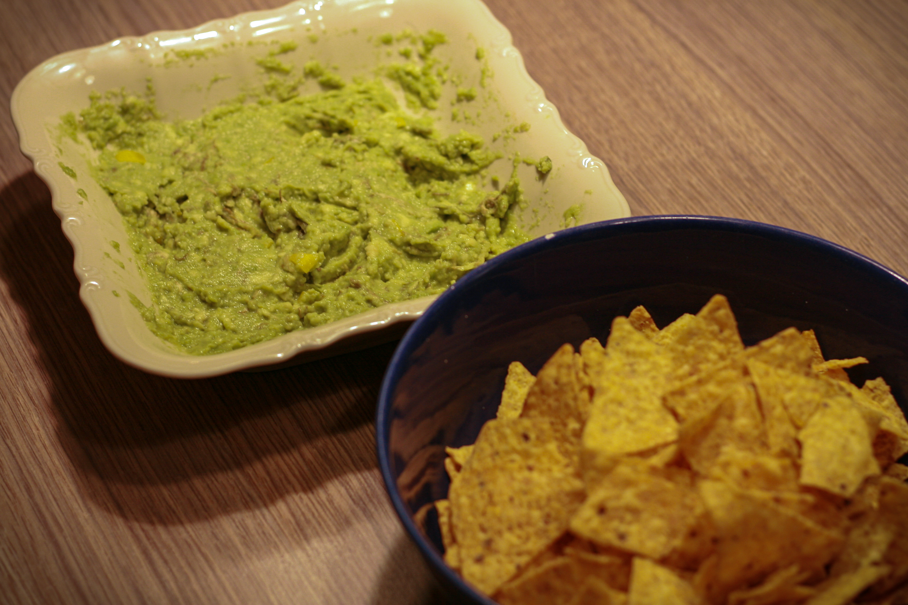

# Zapečené wrapy s kukuřičnými lupínky a guacamole

_Zdroj: Apetit, červen 2022, strana 64_

Pro 4 osoby

## Ingredience

- 250g kuřecích prsních řízků
- sůl a čerstvě mletý pepř
- 1 cibule, nasekaná nadrobno
- 2 lžíce rostlinného oleje + na vymazání
- 1 stroužek česneku, nasekaný nadrobno 
- 1 lžička celého římského kmínu 
- 1 červená paprika, nakrájená na kostičky 
- 1 červená chilli paprička, zbavená semínek a nakrájená nadrobno 
- 400g konzerva drcených či krájených rajčat
- 200g červených fazolí z konzervy, okapané a slité 
- 100g zrnek kukuřice z konzervy, slitých a okapaných 
- 4 tortilly 
- 120g nastrouhaného čedaru

### Na guacamole

- 2 avokáda, oloupaná a bez pecky
- 1 zelená chilli paprička, nadrobno
- 1 červená chilli paprička, nadrobno
- 2 lžíce limetové šťávy + sůl
- 75g tortillových lupínků k podávání

## Postup

Kuřecí maso osušte papírovou utěrkou, osolte, opepřete a nakrájejte na kostky. Cibuli opékejte ve velké pánvi na rozehřátém oleji dosklovita, pak vsypte česnek a římský kmín. Přidejte kuřecí maso a opečte dozlatohněda. Vsypte papriku a chilli papričku, krátce dohromady opečte, přilijte rajčata, fazole a trochu vody na zředění. Zhruba 10-15 minut zvolna vařte. Pak vmíchejte kukuřici a nechte ji prohřát. Podle potřeby osolte, opepřete a zamíchejte. 

Troubu předehřejte na 200°C Tortilly naplňte kuřecí směsí, zarolujte a vložte do olejem vytřené zapékací mísy. Posypte sýrem a navrch rozdělte omáčku, pokud vám zbude. Zapečte cca 15 minut dozlatohněda. 

Na guacamole rozmačkejte najemno vidličkou dužinu z avokáda. Vmíchejte chilli papričky (množství volte podle chuti) a dochuťte limetovou šťávou a solí. Wrapy podávejte s kukuřičnými lupínky a guacamole.
